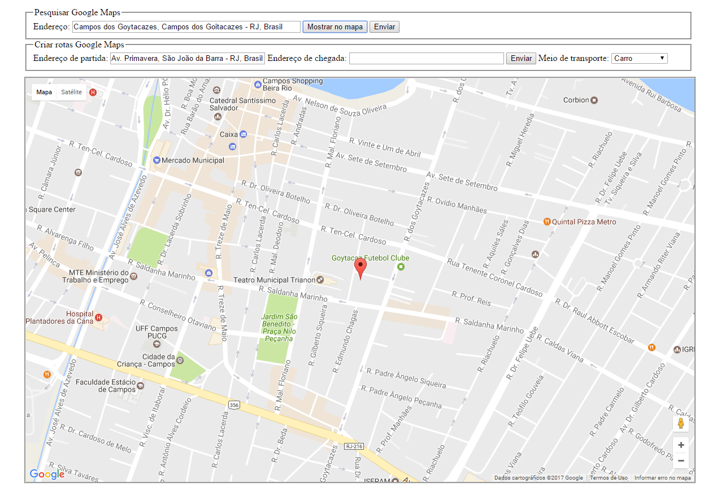

# Estudo sobre Google Maps API

Este simples projeto implementa algumas funções utilizando o Google Maps API.
Entre elas temos:
<ul>
	<li>Marcação de endereços oriundos de algum banco de dados no mapa. Cada ponto exibe as informações de cada lugar
para descrever o local.</li>
	<li>Busca por lugares a partir do endereço informado.</li>
	<li>Função de autocomplete nas buscas.</li>
	<li>Marcação de trajetória entre dois pontos (End. de partidade e End. de destino).</li>
	<li>Informação em texto sobre a trajetória entre dois pontos.</li>
	<li>Escolha de meio de transporte utilizado.</li>
	<li>Ícone personalizado para demarcar um ponto.</li>
	<li>Detecta a localização do usuário.</li>
</ul>

# Exibindo dados do ponto no mapa
Extraindo os dados de um DB e os formatando em JSON podemos percorer os pontos que desejamos exibir no mapa em forma de marcadores. Cada marcador que seja clicado exibe uma caixa branca conforme a imagem abaixo listando algumas informações pertinentes. 

# Função de autocomplete e utilizando o Marker Clusterer Plus 
O Marker Clusterer Plus permite agrupar várias marcações muito próximas em um único ícone conforme o número 3 em azul. Ao clicar no ícone azul o mapa renderiza os pontos que estão naquela região de uma maneira de fácil visualização.

# Pesquisa por endereço
Informando o endereço e clicando em Mostrar no mapa você exibe no mapa a localização do endereço solicitado.

# Marcação entre dois pontos
Informando dois pontos onde um é a origem e o outro o destino, podemos traçar uma trajetória entre estes dois pontos. A trajetória também é exibida em modo de texto conforme a imagem abaixo. 

# Finalizando
Este estudo objetivou o entendimento básico para outras implementações futuras. A idéia principal foi de apenas conhecer um pouco sobre a API e conseguir construir alguma coisa.

Para esta implementação foi usado como base de pesquisa alguns artigos como:
<ul>
	<li>
		<a href="http://www.princiweb.com.br/blog/programacao/google-apis/google-maps-api-v3-criando-um-mapa-personalizado.html">
			Google Maps API v3: Criando um mapa personalizado
		</a>
	</li>
	<li>
		<a href="http://www.princiweb.com.br/blog/programacao/google-apis/google-maps-api-v3-busca-de-endereco-e-autocomplete.html">
			Google Maps API v3: Busca de endereço e Autocomplete
		</a>
	</li>
	<li>
		<a href="http://www.princiweb.com.br/blog/programacao/google-apis/google-maps-api-v3-criando-rotas-entre-multiplos-pontos.html">
			Google Maps API v3: Criando rotas entre múltiplos pontos
		</a>
	</li>
	<li>
		<a href="http://googlemaps.github.io/libraries.html">
			Google Maps API Libraries
		</a>
	</li>
</ul>